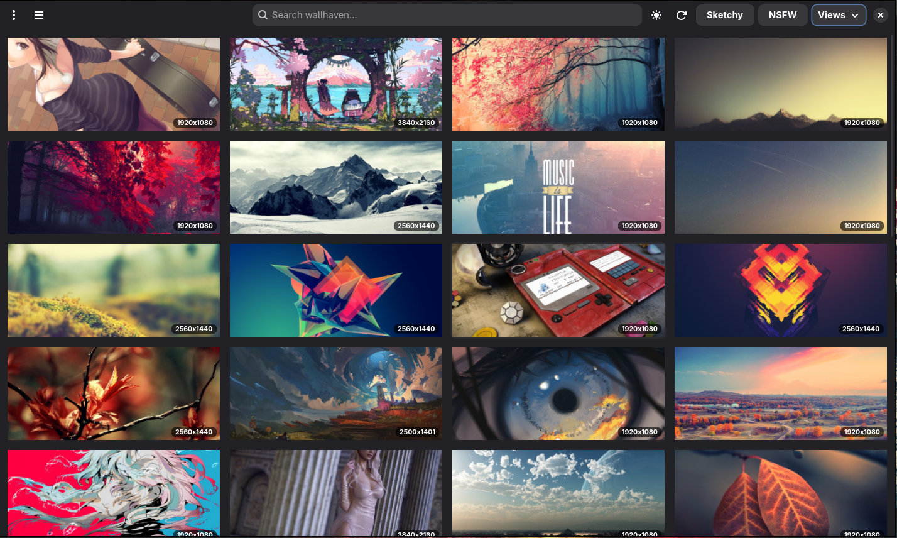

# Wallpick

> A sleek wallpaper browser and setter for Linux — powered by [Wallhaven](https://wallhaven.cc).


Wallpick lets you browse, search, filter, and apply wallpapers from Wallhaven directly to your Linux desktop — all from a clean, native GTK4 interface with dark mode, keyboard shortcuts, and support for multiple wallpaper backends.



---

## ✨ Features

- 🖼️ **Browse & Search** — Full Wallhaven search with filters for categories, purity, resolution, and aspect ratio
- 🎨 **Apply Instantly** — Set wallpapers via awww, swww, hyprpaper, feh, GNOME, or KDE
- 💾 **Download** — Save wallpapers with custom filenames to any directory
- 🌙 **Dark / Light Theme** — Toggle with a single click or `Ctrl+D`
- ⌨️ **Keyboard Shortcuts** — Full keyboard-driven workflow
- 🔞 **NSFW Support** — Optionally unlock Sketchy/NSFW content with your Wallhaven API key
- 🚀 **First-Run Setup** — Guided setup on first launch — no config file editing required
- 📦 **System Integration** — Installs as a proper desktop app with app menu entry

---

## 📦 Installation

### 1. Install dependencies

```bash
# Arch Linux / Manjaro
sudo pacman -S python-gobject gtk4 libadwaita python-requests python-pip

# Fedora
sudo dnf install python3-gobject gtk4 libadwaita python3-requests python3-pip

# Ubuntu / Debian (22.04+)
sudo apt install python3-gi gir1.2-gtk-4.0 gir1.2-adw-1 python3-requests python3-pip
```

### 2. Clone and install

```bash
git clone https://github.com/alyasmrthi/wallpick.git
cd wallpick
./install.sh
```

This installs `wallpick` as a command and registers it in your app menu.

For a system-wide install:

```bash
sudo ./install.sh
```

### Run without installing

```bash
python3 wallpick.py
```

### Uninstall

```bash
./uninstall.sh
```

---

## 🔑 API Key

**No API key is needed for SFW browsing** — just install and use.

To unlock **Sketchy** and **NSFW** content, you need a free Wallhaven API key:

1. Create an account at [wallhaven.cc](https://wallhaven.cc)
2. Go to [Account Settings](https://wallhaven.cc/settings/account) and copy your API key
3. Paste it in the first-run dialog, or later via **☰ → Set API Key** / `Ctrl+K`

You can also use an environment variable:

```bash
export WALLHAVEN_API_KEY="your-key-here"
```

---

## ⌨️ Keyboard Shortcuts

| Shortcut | Action |
| --- | --- |
| `Ctrl+F` | Focus search bar |
| `Ctrl+R` / `F5` | Reload / refresh results |
| `Escape` | Go back to grid from detail view |
| `Ctrl+Q` | Quit |
| `Ctrl+A` | Apply wallpaper to desktop |
| `Ctrl+S` | Download wallpaper |
| `Ctrl+W` | Open wallpaper on wallhaven.cc |
| `Ctrl+D` | Toggle dark / light theme |
| `Ctrl+K` | Set / change API key |

You can also view these in-app via **☰ → Keyboard Shortcuts**.

---

## 🎨 Wallpaper Backends

Wallpick auto-detects your wallpaper backend and uses the first one available:

| Backend | Detected via |
| --- | --- |
| awww | `awww` |
| swww | `swww` |
| hyprpaper | `hyprctl` |
| feh | `feh` |
| GNOME | `gsettings` |
| KDE Plasma | `plasma-apply-wallpaperimage` |

To force a specific command, set `setter_command` in your config:

```json
"setter_command": "swww img {path} --transition-type fade --transition-fps 30"
```

---

## ⚙️ Configuration

All settings are stored in `~/.config/wallpick/config.json` (mode 600).
Everything changed in the UI is automatically saved.

| Key | Description |
| --- | --- |
| `api_key` | Wallhaven API key (set via dialog or `Ctrl+K`) |
| `download_dir` | Download destination folder |
| `setter_command` | Custom wallpaper apply command (`{path}` is replaced) |
| `categories` | `"111"` = general, anime, people (3-bit toggle) |
| `sketchy` / `nsfw` | Purity toggles (SFW is always on) |
| `sorting` | `date_added`, `toplist`, `views`, `favorites`, `random`, `relevance` |
| `order` | `desc` or `asc` |
| `top_range` | Toplist range: `1d`, `3d`, `1w`, `1M`, `3M`, `6M`, `1y` |
| `atleast` | Minimum resolution, e.g. `"1920x1080"` |
| `ratios` | Aspect ratios, e.g. `"16x9,16x10"` |
| `dark_theme` | `true` for dark mode, `false` for light |
| `thumb_width` | Grid thumbnail width in pixels |
| `concurrent_thumbs` | Parallel thumbnail fetches |

---

## 📁 Project Structure

```
wallpick/
├── wallpick.py              # Entry point (for running without install)
├── pyproject.toml            # Build & install configuration
├── install.sh                # One-command install script
├── uninstall.sh              # One-command uninstall script
├── requirements.txt          # Python dependencies
├── data/
│   └── cc.wallhaven.wallpick.desktop   # Desktop entry for app menus
└── wallpick/
    ├── __init__.py            # Package metadata
    ├── api.py                 # Wallhaven API client & rate limiter
    ├── config.py              # XDG paths, defaults, persistence
    ├── setter.py              # Wallpaper backend detection & applying
    └── ui.py                  # GTK4 / libadwaita UI, dialogs, shortcuts
```

---

## 🗒️ Notes

- The API rate limiter caps at 40 req/min (under Wallhaven's 45/min ceiling). Thumbnails are fetched from CDN and aren't counted.
- Thumbnails are cached in `~/.cache/wallpick/thumbs/`, full images in `~/.cache/wallpick/full/`.
- After applying a wallpaper, a breadcrumb is written to `~/.cache/wallpick/current.json` and a symlink at `~/.cache/wallpick/current` — useful for colour-scheme scripts.

---

## 🚧 Roadmap

- [ ] Collections & favourites
- [ ] Multi-monitor wallpaper targets
- [ ] Slideshow / auto-rotate timer
- [ ] Headless CLI mode for scripting

---

## 📜 License

This project is licensed under the [MIT License](LICENSE).

---

## 🤝 Contributing

Contributions, issues, and feature requests are welcome.
Feel free to open an issue or submit a pull request.
